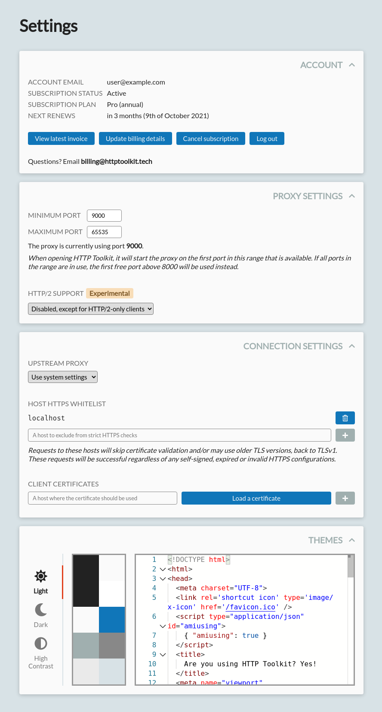
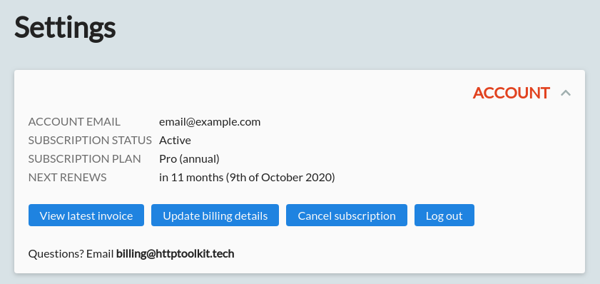
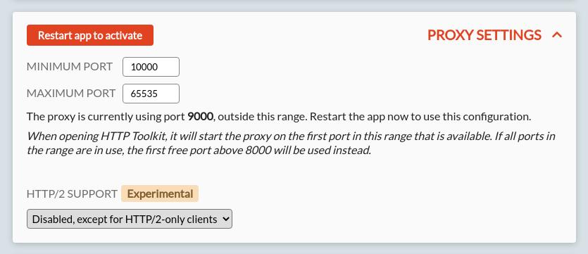
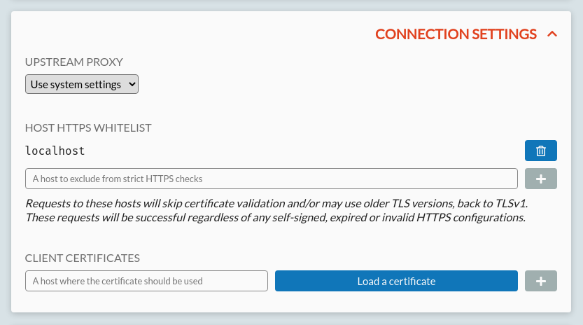
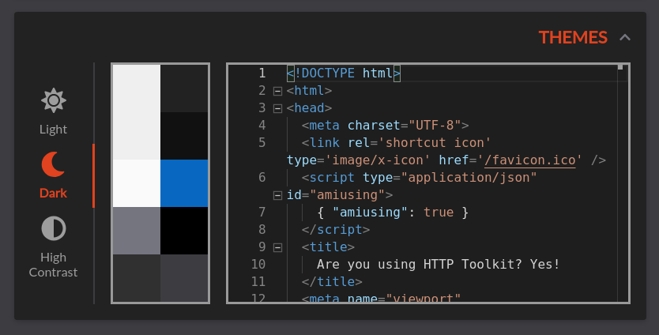

The Settings page is only available to [HTTP Toolkit Pro](/get-pro/) users. It allows you to configure extra proxy settings, UI themes, and manage your account.

It looks like this:

There are four cards here, each of which can be collapsed or expanded as required by clicking or pressing enter on the title and chevron in the top right. The cards are:

* The Account card, which allows you to manage your user account and subscription.
* The Proxy Settings card, which allows you to configure how the proxy is used by intercepted applications.
* The Connection Settings card, which allows you to configure how upstream connections behave.
* The Themes card, which allows you to select themes and see their settings at a glance.

## Account Settings

The account card shows the details of your current account:

* The email address that you've used to log in.
* Your current subscription status:
    * Active: you have an active subscription that is renewing as normal.
    * Active (Trial): you have an active subscription that's still in the trial phase.
    * Past due: you have an active subscription that's failed to renew, and will expire shortly if not resolved.
    * Cancelled: your subscription is currently active, but has been cancelled, and will expire shortly.
* Your subscription plan: Pro or Team, Annual or Monthly.
* Your next payment date:
    * When your subscription next renews, if it's active or on a trial
    * When the payment will next be retried, if you're currently past due
    * When your subscription will fully expire, if it's cancelled.

Cancelled users retain access to paid features until the end of their last paid subscription period.

Subscriptions that are past due will have their payments retried automatically a few times over the following week, and you'll be sent emails about this, with instructions on how to update your details or how to cancel immediately. If the payments succeed, the account will become active again as normal. If not, after the 3rd attempt the subscription will cancelled and expire immediately.

Below these details, there's a few buttons available:

* View latest invoice: opens your latest invoice in your browser.
* Update billing details: opens a page in your browser allowing you to update your payment method.
* Cancel subscription: opens a page in your browser allowing you to immediately cancel your subscription.
* Log out: logs you out, taking away your access to all paid features.

Pro users will see all of these buttons. Team members on an account where they are not the main billing user will see only the 'Log out' button.

## Proxy Settings

The proxy settings card allows you to reconfigure various settings of the internal HTTP Toolkit proxy, to change how it behaves from the point of view of intercepted clients.

All changes here require a restart of the app to take effect, and a button will appear in the top left of the card allowing you to do that when required, as shown above.

There's two settings you can edit here:

### Proxy Port Ranges

At startup, HTTP Toolkit will listen on the first available port in the configured range. By default that is any port above 8000.

For advanced use cases, you can configure the range to use for yourself, which can be useful if you want more precise control, or you intend to use port 8000 for another process and need to ensure it remains available.

If every single port in the range is unavailable, HTTP Toolkit will fall back to its default settings and use the first free port above 8000. If no ports above 8000 are available at all then HTTP Toolkit will fail to start.

### HTTP/2 Behaviour

HTTP Toolkit supports both HTTP/1 and HTTP/2, over both plain text and TLS (HTTPS) connections.

However, because HTTP/1 is simpler, more widely supported, and generally more mature, for debugging purposes it's often preferable to use HTTP/1 instead of HTTP/2 with clients who support both.

When receiving an incoming HTTPS connection, HTTP Toolkit detects the HTTP/2 support of the intercepted client using [ALPN](https://en.wikipedia.org/wiki/Application-Layer_Protocol_Negotiation), a TLS standard where clients and servers negotiate the protocol they will use as connections are set up. This allows HTTP Toolkit to decide whether or not to use HTTP/2 on each incoming connection.

This negotiation behaviour is configurable to one of three settings:

* HTTP/2 disabled for all clients - in this case, HTTP Toolkit will never use HTTP/2.
* HTTP/2 enabled for all clients - in this case, HTTP Toolkit will use HTTP/2 with every client that supports it.
* HTTP/2 disabled, except for HTTP/2-only clients - in this case (the default) HTTP Toolkit will use HTTP/1 with clients who support both protocols, but HTTP/2 with clients who only support HTTP/2 (e.g. gRPC-based clients).

For plain HTTP clients no negotiation step is supported. Both HTTP/2 with prior knowledge and HTTP/1 are both always available, detected based on the initial bytes of the request from the client. Note though that plain-text HTTP/2 (h2c) is rarely supported in either clients or servers so almost all HTTP/2 is negotiated over HTTPS with ALPN, and this is rarely applicable.

## Connection Settings

The connection settings card allows you to reconfigure the settings for upstream connections (connections between HTTP Toolkit and remote servers), to change how HTTP Toolkit behaves from the point of view of the target server.

All changes take effect immediately when the corresponding save/add/delete button is pressed.

There's three settings you can edit here:

### Upstream proxy settings

HTTP Toolkit supports forwarding requests via upstream proxies, for use in enterprise environments, or to chain HTTP Toolkit with other proxy tools.

There are 5 available configurations:

* Direct - all requests will be sent directly.
* System - the system proxy settings will be used.
* HTTP - a custom HTTP proxy and no-proxy list will be used
* HTTPS - a custom HTTPS proxy and no-proxy list will be used
* SOCKS - a custom SOCKS proxy and no-proxy list will be used

When HTTP, HTTPS or SOCKS is selected, additional configuration options are shown, to allow you to enter the proxy address, and to add a list of hosts whose traffic should always be sent directly, ignoring the proxy.

The proxy address should be entered as a standard proxy URL, but skipping the protocol that was already selected in the dropdown. For example:

* `example.com` - a hostname by itself, using the default port for the protocol
* `123.1.2.3` - an ip address by itself, using the default port
* `username:password@proxy.example.com:8080` - a proxy hostname (`proxy.example.com`), with a specific port (`8080`), and authenticating with a given username and password.

When using system mode, the system proxy settings will generally be used as defined in your operating system configuration, with one exception: if the system is configured to use a localhost proxy. In this case, the proxy is ignored and a warning is shown, to avoid common issues when HTTP Toolkit itself is configured as the system proxy, resulting in a recursive proxy loop. If you do want to use a localhost proxy, you can do so by manually configuring the proxy instead.

### Host Certificate Whitelist

HTTP Toolkit allows you to configure a list of hosts whose TLS connections will not be securely validated. This allows use of invalid, self-signed or expired TLS certificates, and deprecated TLS versions (back to TLSv1) for testing and compatibility.

By default, both both free and Pro users, this applies only to `localhost`, allowing for convenient local HTTPS development. If you're also using self-signed remote network servers though or working with very old server software that doesn't support modern TLS versions then you may want to add those hosts here.

### Client Certificates

Some servers require a client certificate for authentication when a connection is established with HTTP Toolkit. To support this, you can configure client certificates here in the settings, linking them to the hostname where they will be used.

To do so, simply enter a hostname and click the 'Load certificate' button to load a certificate. Certificates must be in PKCS#12 (.p12 or .pfx) format. If required you'll be also prompted for a passphrase for the certificate. Enter your passphrase and press the unlock button to test it. Once your certificate is loaded & unlocked, and you've entered the hostname, press the + button to save it.

Note that client certificates are necessarily stored unencrypted in HTTP Toolkit's settings on disk. They are never shared outside your machine, but storing very sensitive certificates on disk unencrypted may be a concern in some security environments. If this is an issue, you can remove the certificate from HTTP Toolkit's settings after use to immediately and completely remove them from storage.

## Themes

The theme settings card allows you to change the app theme.

Select one of the three themes on the left to immediately change the whole app's theme.

All colours used in the theme are shown on the right, along with an editor containing some example HTML (actually the contents of the default intercepted [amiusing.httptoolkit.tech](https://amiusing.httptoolkit.tech) page!), so you can see it all live.

**Any questions? [Get in touch](/contact/)**